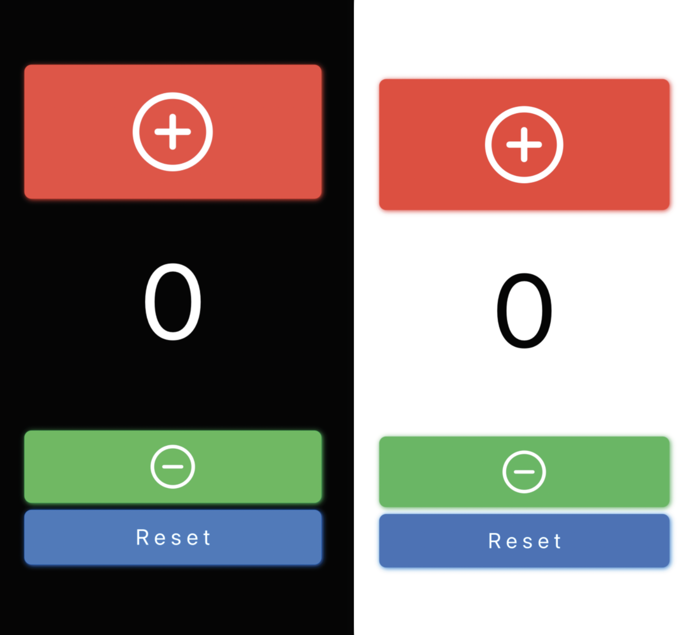

# reptracker
iOS Exercise Rep Counting App  

## Overview
I created a simple rep tracking app to keep track of my reps so that I don't lose track. SwiftUI was used to make the app and it consists of only three buttons: increment, decrement and reset. Modifiers were included inside the buttons so that the entirety of the button can be clicked, rather than just the text. SF Symbols used for the + and - symbols for increment and decrement, respectively. Honestly just needed something to count my reps, nothing complicated.
